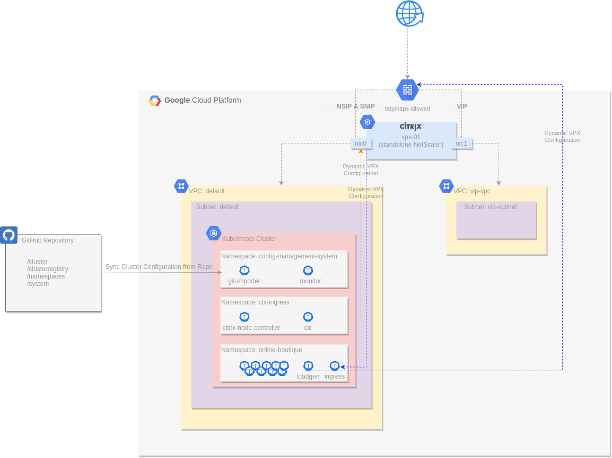

Photo by <a href="https://unsplash.com/@growtika?utm_source=unsplash&utm_medium=referral&utm_content=creditCopyText">Growtika</a> on <a href="https://unsplash.com/photos/183Yxo3vsGY?utm_source=unsplash&utm_medium=referral&utm_content=creditCopyText">Unsplash</a>

&nbsp;  

In the <a href="../netscaler-with-google-anthos-part1">first blog post</a> in our NetScaler with Google Anthos series, we talked about the importance of modern app delivery and security for hybrid multi-cloud for IT transformation and app modernization, and how NetScaler and Google Anthos together can provide consistent, reliable app delivery and security, for all workloads (hybrid and multi-cloud), by applying enterprise cloud-native patterns.

In this blog post, we will cover how NetScaler can work seamlessly with Google Kubernetes Engine (GKE) to provide consistent, reliable app delivery for Kubernetes apps. We will focus on NetScaler's autoscaling capabilities, why they’re important, and how NetScaler is designed to work with the underlying Anthos GKE cluster for meeting increased user demand. We will see how GitOps paradigm can enhance continuous configuration, and we will make use of Anthos Config Management for Automating NetScaler Day 2 operations.

>NetScaler is an application delivery controller designed to accelerate application performance, enhance application availability with advanced L4-7 load balancing, and lower application server expenses by offloading computationally intensive tasks. NetScaler architecture is designed to do so by leveraging its Virtual Servers and Service Groups concept.

NetScaler has worked to make NetScaler capabilities available for modern apps and has released a suite of components for microservices-based architectures that can seamlessly be deployed in a Kubernetes cluster. With NetScaler Ingress Controller, an implementation of Kubernetes Ingress Controller, and the help of NetScaler Node Controller, you can manage and route traffic into a Kubernetes cluster using NetScaler ADCs. By using NetScaler Ingress Controller, you can configure NetScaler according to the ingress rules, integrate your NetScaler ADCs with the Kubernetes environment, and leverage NetScaler ADC‘s top level app delivery and security capabilities for your modern apps. By creating smart annotations, Kubernetes CRDs and more, NetScaler made NetScaler enterprise-level capabilities available in the form of Configuration as Code. Authentication, rate limiting, rewrite/responder policies, content routing, WAF, bot management, CORS and more can be easily configured as code. This leads to easy configuration without requiring any previous experience with NetScaler ADCs.

DevOps, CloudOps and SecOps teams can leverage these to introduce a new level of network and security automation. By being able to configure ADCs from within the Kubernetes cluster, NetScaler has visibility within the Kubernetes cluster and can auto adopt and respond to Kubernetes events.

## Architecture

Here, we’ll focus on deploying a Tier-1 NetScaler (VPX) in front of a Google Anthos GKE cluster within GCP. We will leverage Google Anthos Configuration Management for consistent deployment of NetScaler components into the Anthos GKE cluster and highlight how NetScaler is automatically configured from the GKE cluster to add new Virtual Servers and Service Group Members as an application is deployed and scaled to meet user demand.

Anthos Configuration Management (ACM) is a GitOps-centric tool that synchronizes configuration into an Anthos Kubernetes cluster from a Git repository. This lab automation has been written with GitHub as the Git repository tool of choice.

The following diagram shows the infrastructure used by our Lab that we’ll deploy (click image to view larger).

### NetScaler VPX

A single NetScaler VPX instance is deployed with two network interfaces:

- nic0 provides access for management (NSIP) and access to back-end servers (SNIP).
- nic1 provides access for deployed applications (VIPs).
- Each interface is assigned an internal private IP address and an external public IP address.
- The instance is deployed as a pre-emptible node to reduce lab costs.
- The instance automatically configures the password with Terraform.
- The instance is then automatically configured by the NetScaler Ingress Controller and NetScaler Node Controller deployed in the GKE cluster.

### VPCs and Firewall Rules

Two VPCs are used in this deployment:

- The default VPC and subnets are used for instance and GKE cluster deployment.
- The vip-vpc is used only to host VIP addresses, which route the traffic back to the services in the default VPC.
- Default firewall rules apply to the default VPC.
- Ports 80/443 are permitted into the vip-vpc.

### GKE Cluster with Anthos Configuration Management
A single GKE cluster is deployed as a zonal cluster:

- Autoscaling is enabled with a minimum of one node and configurable maximum.
- The Google Anthos Config Management (ACM) operator is deployed into the GKE cluster and configured to sync the cluster configuration from a GitHub repository.
- NetScaler Ingress Controller and NetScaler Node Controller components are automatically installed via ACM into the ctx-ingress namespace.
- Worker nodes are deployed as pre-emptible nodes to reduce lab costs.

### GitHub Repository
A dedicated GitHub repository is created and loaded with a basic cluster configuration:

- A basic hierarchical format is used for ease of navigation through namespaces and manifests.
- NetScaler Ingress Controller and NetScaler Node Controller deployment manifests are built from templates and added to this repository, along with their other required roles / rolebindings / services / etc.
- This repository is created and destroyed by Terraform.

### Online Boutique Demo Application
The online boutique demo application provides a μServices-based application that will be used to highlight the autoscaling application use case. It has been modified slightly for this environment:

- An ingress resource has been added to receive all traffic through the NetScaler VPX.
- A Horizontal Pod Autoscaler has been added for the frontend resource to demonstrate scaling capabilities.
- The loadgen deployment has been modified to send traffic through the NetScaler VPX.
- Application components are controlled through Anthos Config Management and the source git Repo.

To deploy this lab and see autoscaling in action, please check the code on <a target="_blank" href="https://github.com/citrix/cloud-native-getting-started/blob/master/gcp/anthos/scaleup/README.md"> GitHub</a>.

## What's next?

In our next blog post, we will discuss <a href="../netscaler-with-google-anthos-part3">how NetScaler Web App Firewall can work with Anthos Policy Controller to provide app protection and policy enforcement for Kubernetes apps</a>.

&nbsp;  

* This blog was originally published at <a target="_blank" href="https://www.citrix.com/blogs/2022/05/24/citrix-adc-with-google-anthos-consistent-reliable-app-delivery-for-kubernetes-apps/">Citrix Blogs</a>

&nbsp; 