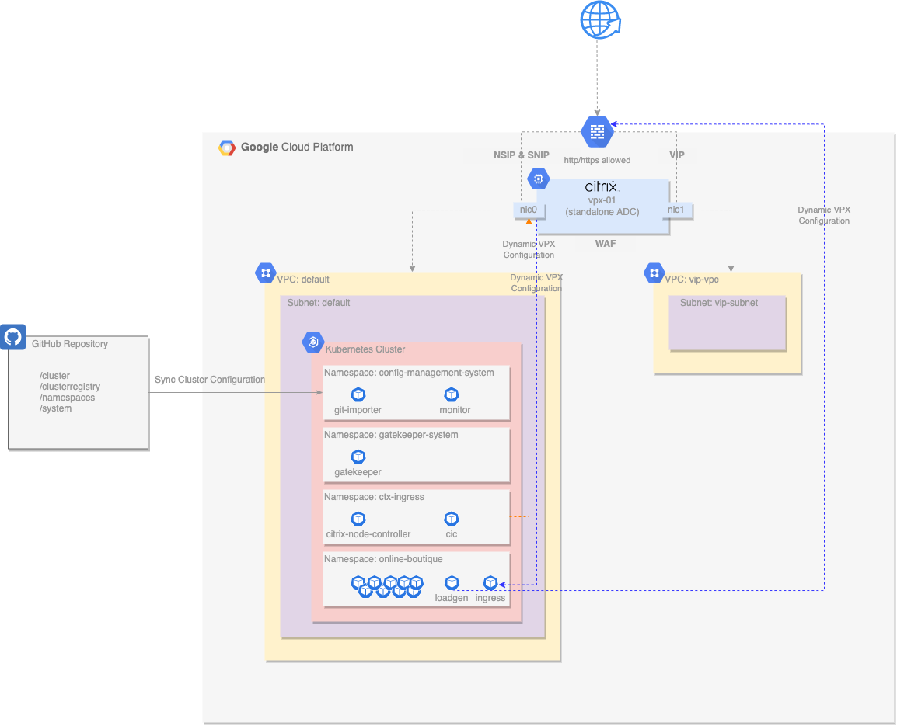

Photo by <a href="https://unsplash.com/@growtika?utm_source=unsplash&utm_medium=referral&utm_content=creditCopyText">Growtika</a> on <a href="https://unsplash.com/photos/183Yxo3vsGY?utm_source=unsplash&utm_medium=referral&utm_content=creditCopyText">Unsplash</a>

&nbsp;  

This is the third post in our series on NetScaler with Google Anthos. In our <a href="../netscaler-with-google-anthos-part1">first post</a>, we talked about the importance of modern app deliver and security for hybrid multi-cloud, and in our <a href="../netscaler-with-google-anthos-part2">second post</a>, we focused on achieving consistent and reliable app delivery for Kubernetes apps and shared a lab on GitHub for readers to test.

In this post, we’ll focus on security and demonstrate how:
- NetScaler can strengthen your security posture across hybrid and multi-cloud.
- NetScaler Web App Firewall (WAF) works seamlessly with Google Anthos Policy Controller to provide protection for Kubernetes apps and APIs.
- NetScaler Web App Firewall with Google Anthos Policy Controller enforce app protection using configuration as code
- GitOps enhances continuous configuration along with Google Anthos Config Management for automating security configuration.

## Protecting Web Apps and APIs

When it comes to application delivery, security is a top priority. Web apps and APIs are often an organization’s most valuable but vulnerable assets, and to reach production and go live, there are several requirements that need to be met. From governance and compliance requirements to organization-specific requirements, the task is not an easy one.

NetScaler Web App Firewall has proven and robust security controls to protect apps against known and unknown application attacks. It defends apps and APIs against OWASP top 10 threats and zero-day attacks and provides security insights for faster remediation. To learn how NetScaler Web App Firewall is designed to provide security, check out our product documentation. Our introduction to NetScaler Web App Firewall, overview of security checks, and FAQs and deployment guide are great resources to help you get started.

NetScaler Web App Firewall is designed to be easily enabled and configured as code following the infrastructure and configuration as code paradigms. By providing WAF, bot management, CORS CRD for Kubernetes, security configurations are now possible from within a GKE cluster. You can now automate the configuration of both Tier-1 and Tier-2 NetScaler Web App Firewalls easily.

Common protections such as buffer overflow, cross site request forgery (CSRF), cross site scripting (XSS), SQL injection, URL allow lists and block lists, or more advanced ones can be easily enabled as policies using simple YAML files. Combining these capabilities with policy agents (as we’ll see in our lab) introduces an enterprise-grade practice of configuring and automating security.

The key advantage of using NetScaler WAF is that it uses a single code base across all NetScaler form factors (MPX and SDX, as well as VPX and CPX) so you can consistently apply and enforce security policies across any application environment. That gives you ease of deployment and simplicity in configurations which saves time and reduces configuration errors.

NetScaler Web App Firewall follows well-established principles that provide DevOps, CloudOps and SecOps teams with the tools they need to effectively do their job. By supporting both positive and negative security models NetScaler Web App Firewall provides the widest protection possible. In addition to that, common event format (CEF) logging enables customers to easily collect and aggregate WAF data for analysis by an enterprise management system. Configuring and integrating a WAF has never been easier.

Because security configurations can be part of the source code and stored in Git, different configurations can be created and maintained per environment. “Shifting Security Left” in the early stages of testing can become easier and Dev(Sec)Ops practices can be applied. Configurations are now closer to meeting the actual need, closer to the apps that need protection, and can eliminate false positives. And with a single point of truth, full visibility is achieved for both Operations and Audit teams, making it even easier to perform required audits.

## Deploying a Modern Application Architecture

Here, we’ll focus on deploying a Tier-1 NetScaler (VPX) in front of a Google Anthos GKE cluster within GCP. We will leverage Google Anthos Configuration Management for consistent deployment of NetScaler components into the Anthos GKE cluster. Additionally, we’ll leverage Google Anthos Policy Controller to ensure that NetScaler Web App Firewall configurations exist to protect ingress objects within a cluster.

ACM (Anthos Configuration Management) is a GitOps-centric tool that synchronizes configuration into a Anthos Kubernetes cluster from a Git repository. Policy Controller is a component of ACM that can audit or enforce configurations across the cluster. This lab automation has been written with GitHub as the git repository tool of choice.

The following diagram illustrates the infrastructure used by our lab that will be deployed. 

### NetScaler VPX

A single NetScaler VPX instance is deployed with two network interfaces:

- nic0 provides access for management (NSIP) and access to back-end servers (SNIP).
- nic1 provides access for deployed applications (VIPs).
- Each interface is assigned an internal private IP address and an external public IP address.
- The instance is deployed as a pre-emptible node to reduce lab costs.
- The instance automatically configures the password with Terraform.
- The instance is then automatically configured by the NetScaler Ingress Controller and NetScaler Node Controller deployed in the GKE cluster.

### VPCs and Firewall Rules

Two VPCs are used in this deployment:

- The default VPC and subnets are used for instance and GKE cluster deployment.
- The vip-vpc is used only to host VIP addresses, which routes the traffic back to the services in the default VPC.
- Default firewall rules apply to the default VPC.
- Ports 80/443 are permitted into the vip-vpc.

### GKE Cluster with Anthos Configuration Management

A single GKE cluster is deployed as a zonal cluster:

- Autoscaling is enabled with a minimum of one node and a configurable maximum.
- The Google Anthos Config Management (ACM) operator is deployed into the GKE cluster and configured to sync the cluster configuration from a GitHub repository.
- NetScaler Ingress Controller and NetScaler Node Controller components are automatically installed via ACM into the ctx-ingress namespace.
- NetScaler Web App Firewall Custom Resource Definition (CRD) is installed via ACM to enable developers to create WAF configurations.
- Worker nodes are deployed as pre-emptible nodes to reduce lab costs.
- Policy Controller is installed to demonstrate constraints that enforce the presence of a WAF object in a namespace prior to accepting an Ingress resource.

### GitHub Repository

A dedicated GitHub repository is created and loaded with a basic cluster configuration:

- A basic hierarchical format is used for ease of navigation through namespaces and manifests.
- NetScaler Ingress Controller and NetScaler Node Controller deployment manifests are built from templates and added to this repository, along with their other required roles / rolebindings / services / etc.
- This repository is created and destroyed by Terraform.

### Online Boutique Demo Application

The online boutique demo application provides a microservices-based application for our lab. It has been modified slightly for this environment:

- An ingress resource has been added to receive all traffic through the NetScaler VPX.
- Application components are controlled through Anthos Config Management and the source git repo.

To deploy this lab and see App Protection in action, please check the code on <a target="_blank" href="https://github.com/citrix/cloud-native-getting-started/blob/master/gcp/anthos/waf/README.md"> GitHub</a>.

## What's next?

In the next blog post in our series, we will discuss how you can use NetScaler, with its extensive set of policies, as an API gateway for Kubernetes apps.

&nbsp;  

* This blog was originally published at <a target="_blank" href="https://www.citrix.com/blogs/2022/06/07/citrix-adc-with-google-anthos-app-protection-and-policy-enforcement-for-kubernetes-apps/">Citrix Blogs</a>

&nbsp;  