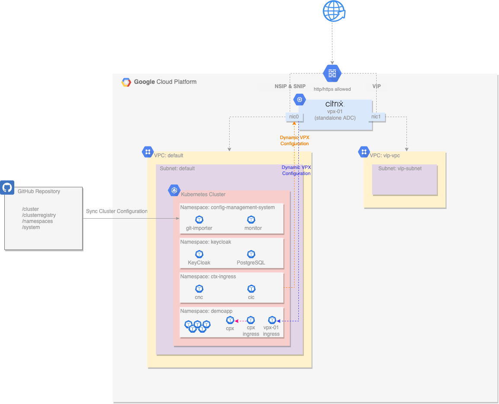
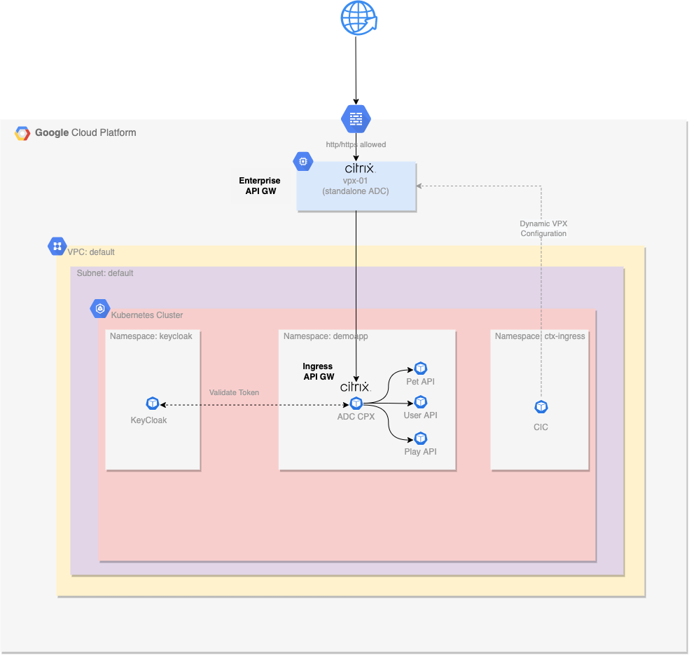

Photo by <a href="https://unsplash.com/@growtika?utm_source=unsplash&utm_medium=referral&utm_content=creditCopyText">Growtika</a> on <a href="https://unsplash.com/photos/183Yxo3vsGY?utm_source=unsplash&utm_medium=referral&utm_content=creditCopyText">Unsplash</a>

&nbsp;  

In the <a href="../netscaler-with-google-anthos-part3">previous post</a> in our series on NetScaler and Google Anthos, we covered the importance of security and how NetScaler can strengthen your security posture across hybrid and multi-cloud using NetScaler Web App Firewall (WAF). NetScaler WAF works seamlessly with Google Anthos Policy Controller to enforce protection for Kubernetes apps and APIs using configuration as code, and the GitOps paradigm enhances Continuous Configuration along with Google Anthos Config Management for automating security configuration.

In this blog post we will look at why APIs are important for organizations, and we will discuss how you can leverage NetScaler , with its extensive set of policies, to provide API gateway functionalities at the edge, as an enterprise API gateway or within a Kubernetes cluster as an ingress API gateway. We will cover a dual-tier topology for API gateways and showcase how we can leverage Google Anthos Config Management for consistent API management and protection.

## Why Are APIs Important?

Finance, manufacturing, transportation, healthcare, and telecommunications are just some of the sectors trying to stay competitive in today’s economy by providing access to services through web APIs. With the increasing adoption of cloud, use of smart devices, IoT and more, demand for APIs continues to increase with hundreds of services provided through public or private APIs.

Developers have long used APIs to share data and integrate with other systems. Although there are several types of APIs, web APIs are the most common, with REST, SOAP, and gRPC the most frequently adopted. As the use of public cloud and consumption of cloud services grows, APIs have become one of the most important aspects of software architecture. With an increasing shift from monolith apps to microservices-based architectures, APIs are no longer just for exposing services to external consumers. APIs have become the standard method for communication between microservices.

There are dozens of architectural patterns for application modernization, and APIs play an important role. Shifting to microservices provides incredible benefits including dynamic scalability, fault isolation, reduced response downtime, and technology stack flexibility to eliminate vendor or technology lock-in and platform dependency.

But all these benefits hide challenges that can require deep expertise on microservices-based architecture concepts. Exposing APIs, handling communication between microservices, applying authentication, authorization, and rate limiting require specific measures to be applied in a proper way. Security, high availability, and more require different handling with API management now becoming a cornerstone for the success of application modernization.

## NetScaler API Gateway

One of the most common architectures for API management and protection is the API gateway. An API gateway acts as a single-entry point for all clients that make API calls to a particular set of back-end services such as containerized web apps in a Kubernetes cluster. The API gateway is responsible for proxying/routing requests to the appropriate services. Learn more about why you need an API gateway, how it works, and what its benefits are.

NetScaler provides an enterprise-grade API gateway for north/south API traffic into the Kubernetes cluster. The API gateway integrates with Kubernetes through the NetScaler Ingress Controller and the NetScaler platforms (MPX, VPX, CPX) deployed as the ingress gateway for on-premises or cloud deployments.

- NetScaler has an extensive set of policies you can use to enforce authentication and authorization policies, rate limit access to services, perform advanced content routing, apply HTTP transactions transformation using rewrite and responder policies, enforce WAF policies and more — all to support secure and reliable access to APIs and to microservices.
- NetScaler’s API gateway is designed to be easily enabled and configured as it follows the infrastructure-as-code and configuration-as-code paradigms. By providing auth, rate limit, content routing, rewrite and responder, WAF CRDs and more, applying policies centrally in an easy manner becomes possible from within a GKE cluster.

By creating simple YAML files you can easily provide common API gateway functionalities such as:

- Authentication mechanism like basic, digest, bearer, API keys, OpenID Connect, SAML, and more.
- Integration with authentication providers like OAuth, LDAP, and more.
- Fine-grained authorization using OAuth 2.0.
- Rate limiting for APIs that are in high demand.
- OWASP-suggested hardening measures using rewrite and responder policies.

The key advantage of using NetScaler API gateway is that it integrates with Kubernetes through NetScaler Ingress Controller and NetScaler . This gives you flexibility as you create your architecture. You can configure an API gateway both on Tier-1 using MPX, VPX and on Tier-2 using CPX.

- Tier 1 ingress will act as an enterprise API gateway sitting in front of Kubernetes clusters and traditional 3-tier applications. Functionalities like WAF and Auth can be offloaded and managed centrally for all environments.
- Tier 2 API gateways can be introduced per Kubernetes cluster, namespace or particular set of apps according to business requirements and SDLC (Software Development Lifecycle) practices being followed. Additionally, when extreme isolation is required you can introduce API gateway functionalities for namespace-to-namespace communication. In this case Tier 2 API gateways can be configured from the team responsible for the appropriate namespace or particular set of apps.

This high level of flexibility gives all the relevant personas the tools required to do their job while focusing on what they do best. NetScaler follows well-established principles that provides DevOps, CloudOps, SecOps and Software Engineering teams with the tools they need to effectively do their job. By supporting the Swagger API specification format, APIs can be defined by software engineers who design the APIs while configuration can be automated from DevOps and CloudOps teams, and security teams can specify the appropriate measures for the APIs to be protected.

Combining these capabilities with GitOps tools like Google Anthos Config Management or adopting NetScaler’s own API Gateway with GitOps implementation introduces an enterprise-grade practice of API management and protection. Because policy configurations can be part of the source code and stored in Git, different configurations can be created and maintained per environment, enhancing SDLC and DevOps practices even more while the API gateway can be deployed closer to the apps that need be managed and protected.

## Modern Application Architectures

In this section, we will focus on deploying:

- Tier 1 NetScaler (VPX) in front of a Google Anthos GKE cluster within GCP. We will leverage Google Anthos Configuration Management for consistent deployment of NetScaler components into the Anthos GKE cluster. VPX will act as a Tier 1 enterprise API gateway where WAF policies will be enabled.
- Tier 2 NetScaler (CPX) using ACM within a Kubernetes namespace that will act as a Tier 2 ingress API gateway for the microservices deployed in that namespace and make use of ACM for consistent Tier 2 API gateway policy configurations. Authentication, authorization, rate limiting, rewrite, and responder policies will be applied for a specific set of APIs.
- Keycloak, one of the most popular open source identity and access management (IAM) solutions, in a dedicated Kubernetes namespace and use it as our identity provider and authorization (OAuth 2.0) server for our Tier-2 CPX API Gateway.

ACM (Anthos Configuration Management) is a GitOps-centric tool that synchronizes configuration into an Anthos Kubernetes cluster from a Git repository. This lab automation has been written with GitHub as the git repository tool of choice.

The following diagram illustrates the infrastructure used by our Lab that will be deployed.

### NetScaler VPX

A single NetScaler VPX instance is deployed with two network interfaces:

- nic0 provides access for management (NSIP), and access to back-end servers (SNIP).
- nic1 provides access for deployed applications (VIPs).
- Each interface is assigned an internal private IP address and an external public IP address.
- The instance is deployed as a pre-emptible node to reduce lab costs.
- The instance automatically configures the password with Terraform.
- The instance is then automatically configured by the NetScaler Ingress Controller and NetScaler Node Controller deployed in the GKE cluster.

### VPCs and Firewall Rules

This deployment uses two VPCs:

- The default VPC and subnets are used for instance and GKE cluster deployment.
- The vip-vpc is used only to host VIP addresses, which routes the traffic back to the services in the default VPC.
- Default firewall rules apply to the default VPC.
- Ports 80/443 are permitted into the vip-vpc.

### GKE Cluster with Anthos Configuration Management

A single GKE cluster is deployed as a zonal cluster:

- Autoscaling is enabled with a minimum of one node and a configurable maximum.
- Google Anthos Config Management (ACM) operator is deployed into the GKE cluster and configured to sync the cluster configuration from a GitHub repository.
- NetScaler Ingress Controller and NetScaler Node Controller components are automatically installed via ACM into the ctx-ingress namespace.
- NetScaler auth, rate limit, rewrite and responder, and WAF CRDs are installed via ACM to enable developers to create policy configurations
- Keycloak with Postgresql database is installed via ACM into the keycloak namespace.
- Worker nodes are deployed as pre-emptible nodes to reduce lab costs.

### GitHub Repository

A dedicated GitHub repository is created and loaded with a basic cluster configuration:

- A basic hierarchical format is used for ease of navigation through namespaces and manifests.
- NetScaler Ingress Controller and NetScaler Node Controller deployment manifests are built from templates and added to this repository, along with their other required roles / rolebindings / services / etc.
- This repository is created and destroyed by Terraform.

### Echoserver Demo Application

An echoserver is a server that replicates the request sent by the client and sends it back. It will be used from our lab to showcase:

- How a request is blocked on Tier 1 VPX based on WAF policies.
- How a request is blocked on Tier 2 CPX based on Authentication / Authorization Policies.
- How a request is blocked on Tier 2 CPX based on Rate limiting policies when a threshold is reached.
- How a request is manipulated (by adding some extra headers) on Tier 2 CPX based on Rewrite policies.
- How a response is manipulated on Tier 2 CPX based on Responder policies.
- For our lab we will deploy a single echoserver instance to see the requests reaching our application and the relevant response.
- To keep it simple, three Kubernetes services will be created (Pet, User, Play) that will use different ports to access the same microservice (echoserver). That will provide us with an easy way of creating different content routes for each one of the Kubernetes services and showcase how we can apply policies to each API endpoint.
- Application components and API gateway configurations are controlled through Anthos Config Management and the source Git Repo.

The following diagram illustrates a high-level architecture, aiming to present the role of each component for our Lab.

To deploy this lab and see API gateway policies in action, please check the code on <a target="_blank" href="https://github.com/citrix/cloud-native-getting-started/blob/master/gcp/anthos/apigw/README.md"> GitHub</a>.

## What's next?

In the next blog post in our series, we will discuss how NetScaler’s security-as-code capabilities enable automation for East/West Security for Modern Apps.

&nbsp;  

* This blog was originally published at <a target="_blank" href="https://www.citrix.com/blogs/2022/06/30/citrix-adc-with-google-anthos-multi-layered-api-protection-for-modern-apps/">Citrix Blogs</a>

&nbsp;  